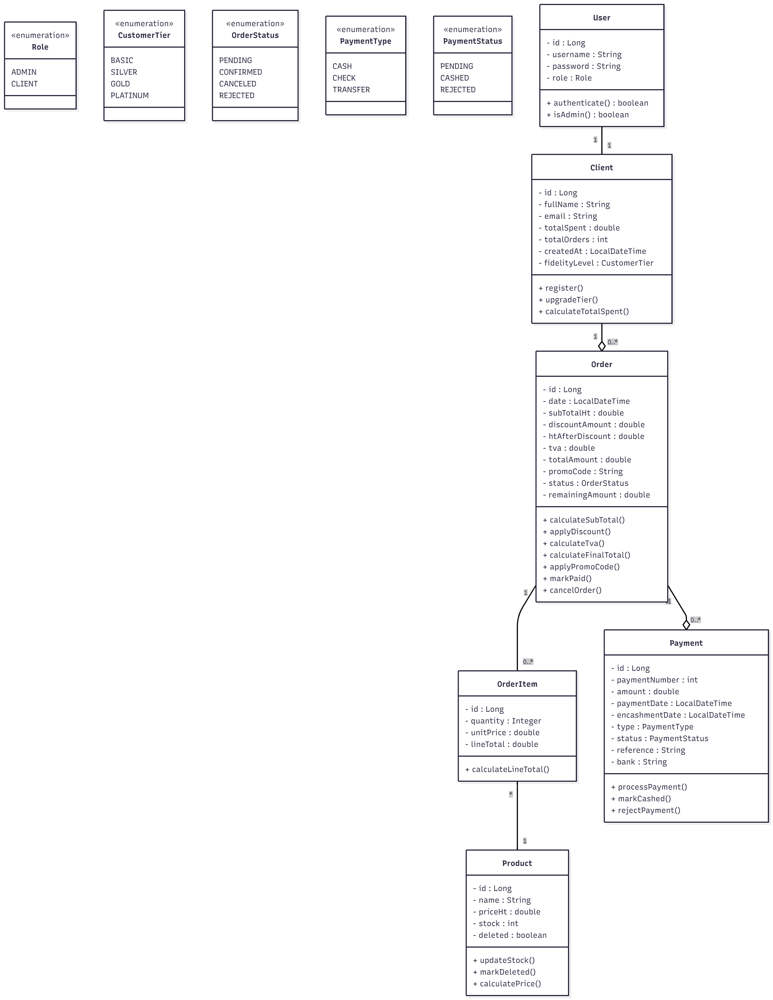

# 🛒 SmartShop - API de Gestion Commerciale B2B

[](https://www.oracle.com/java/)
[](https://spring.io/projects/spring-boot)
[](https://www.postgresql.org/)
[](LICENSE)

> Application REST API de gestion commerciale pour MicroTech Maroc - Distributeur B2B de matériel informatique

## 📋 Table des Matières

- [À Propos](#à-propos)
- [Fonctionnalités](#fonctionnalités)
- [Technologies](#technologies)
- [Architecture](#architecture)
- [Installation](#installation)
- [Configuration](#configuration)
- [Utilisation](#utilisation)
- [Documentation API](#documentation-api)
- [Règles Métier](#règles-métier)
- [Tests](#tests)
- [Contribution](#contribution)
- [Auteur](#auteur)

## 🎯 À Propos

SmartShop est une API REST Backend développée pour **MicroTech Maroc**, distributeur B2B de matériel informatique basé à Casablanca. L'application gère un portefeuille de **650 clients actifs** avec :

- ✅ **Système de fidélité automatique** avec 4 niveaux (BASIC, SILVER, GOLD, PLATINUM)
- ✅ **Paiements fractionnés multi-moyens** (Espèces, Chèques, Virements)
- ✅ **Traçabilité complète** de tous les événements financiers
- ✅ **Gestion optimisée** de la trésorerie et du stock

### 🎨 Type d'Application

- **Backend REST API uniquement** (pas de frontend)
- Tests et démonstrations via **Postman** ou **Swagger**
- Authentification par **HTTP Session** (pas de JWT/Spring Security)
- Format de données : **JSON**

## ✨ Fonctionnalités

### 👥 Gestion des Clients
- CRUD complet des clients
- Suivi automatique des statistiques (nombre de commandes, montant cumulé)
- Historique détaillé des commandes
- Calcul automatique du niveau de fidélité

### 🎖️ Système de Fidélité Intelligent

| Niveau | Critère d'Obtention | Remise | Condition |
|--------|---------------------|--------|-----------|
| **BASIC** | Par défaut | 0% | - |
| **SILVER** | 3 commandes OU 1,000 DH | 5% | si sous-total ≥ 500 DH |
| **GOLD** | 10 commandes OU 5,000 DH | 10% | si sous-total ≥ 800 DH |
| **PLATINUM** | 20 commandes OU 15,000 DH | 15% | si sous-total ≥ 1,200 DH |

> ℹ️ Le niveau est calculé sur l'**historique total** du client et appliqué sur les **futures commandes**

### 📦 Gestion des Produits
- CRUD avec validation du stock
- Soft delete (produits marqués comme supprimés mais conservés dans l'historique)
- Filtres et pagination
- Suivi du stock en temps réel

### 🛍️ Gestion des Commandes
- Commandes multi-produits avec quantités
- Validation automatique du stock
- Calcul automatique :
  - Sous-total HT
  - Remises (fidélité + code promo cumulables)
  - TVA 20% (sur montant après remise)
  - Total TTC
- Gestion des statuts : PENDING → CONFIRMED / CANCELED / REJECTED

### 💳 Système de Paiements Multi-Moyens

| Type | Contrainte | Statuts | Informations |
|------|-----------|---------|--------------|
| **ESPÈCES** | Max 20,000 DH (légal) | Encaissé | Numéro de reçu |
| **CHÈQUE** | Date d'échéance | En attente / Encaissé / Rejeté | N°, banque, échéance |
| **VIREMENT** | Immédiat ou différé | En attente / Encaissé / Rejeté | Référence, banque |

**Règle critique** : Une commande ne peut être validée (CONFIRMED) que si elle est **totalement payée** (montant_restant = 0)

## 🛠️ Technologies

### Backend
- **Java** 8+
- **Spring Boot** 2.7.x
- **Spring Data JPA** / Hibernate
- **Spring Web** (REST Controllers)
- **PostgreSQL** 14+ (ou MySQL)

### Outils & Librairies
- **Lombok** - Réduction du code boilerplate
- **MapStruct** - Conversion Entity ↔ DTO
- **Bean Validation** - Validation des données avec annotations
- **JUnit 5** - Tests unitaires
- **Mockito** - Mocking pour les tests
- **Swagger/OpenAPI** - Documentation API interactive

### Build & Gestion
- **Maven** - Gestion des dépendances
- **Git** - Contrôle de version
- **Postman** - Tests des endpoints

## 🏗️ Architecture

### Structure Multi-Couches

```
📁 src/main/java/com/microtech/smartshop/
├── 📂 controller/          # REST Controllers (endpoints)
├── 📂 service/             # Logique métier
│   ├── 📂 impl/            # Implémentations des services
│   └── 📄 interfaces       # Interfaces des services
├── 📂 repository/          # Accès aux données (JPA)
├── 📂 entity/              # Entités JPA (modèle de données)
├── 📂 dto/                 # Data Transfer Objects
│   ├── 📂 request/         # DTOs pour les requêtes
│   └── 📂 response/        # DTOs pour les réponses
├── 📂 mapper/              # MapStruct mappers
├── 📂 enums/               # Énumérations (OrderStatus, CustomerTier, etc.)
├── 📂 exception/           # Exceptions personnalisées
│   └── 📄 GlobalExceptionHandler.java
├── 📂 config/              # Configuration Spring
└── 📄 SmartShopApplication.java
```

### Modèle de Données (Entités Principales)

```
User (ADMIN/CLIENT)
  └── Client (niveau fidélité, statistiques)
      └── Order (commande)
          ├── OrderItem (produits × quantités)
          └── Payment (paiements fractionnés)
              
Product (stock, prix)
```

### Diagramme de Classes



> 📄 Le diagramme complet est disponible dans le dossier `/docs`

## 🚀 Installation

### Prérequis

- Java JDK 8 ou supérieur
- Maven 3.6+
- PostgreSQL 14+ (ou MySQL 8+)
- Git
- Postman (pour tester l'API)

### Étapes d'Installation

1. **Cloner le repository**
```bash
git clone https://github.com/ManaR-Rch/smartshop.git
cd smartshop
```

2. **Créer la base de données**
```sql
CREATE DATABASE smartshop_db;
CREATE USER smartshop_user WITH PASSWORD 'votre_mot_de_passe';
GRANT ALL PRIVILEGES ON DATABASE smartshop_db TO smartshop_user;
```

3. **Configurer l'application**

Créer/modifier le fichier `src/main/resources/application.properties` :

```properties
# Database Configuration
spring.datasource.url=jdbc:postgresql://localhost:5432/smartshop_db
spring.datasource.username=smartshop_user
spring.datasource.password=votre_mot_de_passe
spring.datasource.driver-class-name=org.postgresql.Driver

# JPA/Hibernate
spring.jpa.hibernate.ddl-auto=update
spring.jpa.show-sql=true
spring.jpa.properties.hibernate.format_sql=true
spring.jpa.properties.hibernate.dialect=org.hibernate.dialect.PostgreSQLDialect

# Server Configuration
server.port=8080
server.servlet.context-path=/api

# Session Configuration
server.servlet.session.timeout=30m
server.servlet.session.cookie.http-only=true

# Logging
logging.level.com.microtech.smartshop=DEBUG
logging.level.org.hibernate.SQL=DEBUG
```

4. **Compiler et lancer l'application**
```bash
mvn clean install
mvn spring-boot:run
```

L'application sera accessible sur : `http://localhost:8080/api`

## ⚙️ Configuration

### Variables d'Environnement

Vous pouvez utiliser des variables d'environnement pour la configuration :

```bash
export DB_HOST=localhost
export DB_PORT=5432
export DB_NAME=smartshop_db
export DB_USER=smartshop_user
export DB_PASSWORD=votre_mot_de_passe
export SERVER_PORT=8080
```

### Paramètres Métier Configurables

Dans `application.properties` :

```properties
# Business Rules
smartshop.vat.rate=0.20
smartshop.payment.cash.limit=20000
smartshop.promo.discount=0.05

# Loyalty Tiers Thresholds
smartshop.loyalty.silver.orders=3
smartshop.loyalty.silver.amount=1000
smartshop.loyalty.gold.orders=10
smartshop.loyalty.gold.amount=5000
smartshop.loyalty.platinum.orders=20
smartshop.loyalty.platinum.amount=15000
```

## 📘 Utilisation

### 1. Authentification

**Login (ADMIN ou CLIENT)**
```http
POST /api/auth/login
Content-Type: application/json

{
  "username": "admin",
  "password": "admin123"
}
```

**Logout**
```http
POST /api/auth/logout
```

### 2. Gestion des Clients

**Créer un client (ADMIN uniquement)**
```http
POST /api/clients
Content-Type: application/json

{
  "nom": "Tech Solutions SARL",
  "email": "contact@techsolutions.ma",
  "telephone": "0522123456",
  "adresse": "123 Bd Zerktouni, Casablanca",
  "ice": "002345678000012"
}
```

**Consulter un client**
```http
GET /api/clients/{id}
```

**Historique des commandes d'un client**
```http
GET /api/clients/{id}/orders
```

### 3. Gestion des Produits

**Ajouter un produit (ADMIN)**
```http
POST /api/products
Content-Type: application/json

{
  "nom": "Dell Latitude 5420",
  "description": "Laptop professionnel 14 pouces",
  "prixUnitaire": 8500.00,
  "stock": 25,
  "categorie": "LAPTOPS"
}
```

**Liste des produits avec filtres**
```http
GET /api/products?page=0&size=10&categorie=LAPTOPS&sort=nom,asc
```

### 4. Créer une Commande

**Créer une commande (ADMIN)**
```http
POST /api/orders
Content-Type: application/json

{
  "clientId": 1,
  "items": [
    {
      "productId": 5,
      "quantite": 2
    },
    {
      "productId": 8,
      "quantite": 1
    }
  ],
  "codePromo": "PROMO-2024"
}
```

**Réponse** :
```json
{
  "id": 123,
  "clientId": 1,
  "clientNom": "Tech Solutions SARL",
  "items": [...],
  "sousTotalHT": 1200.00,
  "remiseFidelite": 120.00,
  "remisePromo": 54.00,
  "montantHTApresRemise": 1026.00,
  "tva": 205.20,
  "totalTTC": 1231.20,
  "montantRestant": 1231.20,
  "statut": "PENDING",
  "dateCreation": "2025-11-28T10:30:00"
}
```

### 5. Effectuer des Paiements

**Ajouter un paiement (ADMIN)**
```http
POST /api/orders/123/payments
Content-Type: application/json

{
  "montant": 1000.00,
  "typePaiement": "ESPECES",
  "reference": "RECU-001",
  "statut": "ENCAISSE"
}
```

**Consulter les paiements d'une commande**
```http
GET /api/orders/123/payments
```

### 6. Valider une Commande

**Confirmer la commande (ADMIN uniquement)**
```http
PUT /api/orders/123/confirm
```

> ⚠️ La commande doit être totalement payée (montantRestant = 0)

**Annuler une commande (ADMIN)**
```http
PUT /api/orders/123/cancel
```

## 📚 Documentation API

### Swagger UI

Une fois l'application lancée, accédez à la documentation interactive :

```
http://localhost:8080/api/swagger-ui.html
```

### Collection Postman

Importez la collection Postman complète disponible dans :
```
docs/SmartShop-API-Collection.json
```

### Endpoints Principaux

| Méthode | Endpoint | Description | Rôle |
|---------|----------|-------------|------|
| POST | `/auth/login` | Connexion | ALL |
| POST | `/auth/logout` | Déconnexion | ALL |
| GET | `/clients` | Liste des clients | ADMIN |
| POST | `/clients` | Créer un client | ADMIN |
| GET | `/clients/{id}` | Détails client | ADMIN/CLIENT (own) |
| PUT | `/clients/{id}` | Modifier client | ADMIN |
| DELETE | `/clients/{id}` | Supprimer client | ADMIN |
| GET | `/clients/{id}/orders` | Commandes du client | ADMIN/CLIENT (own) |
| GET | `/products` | Liste des produits | ALL |
| POST | `/products` | Créer produit | ADMIN |
| PUT | `/products/{id}` | Modifier produit | ADMIN |
| DELETE | `/products/{id}` | Supprimer produit | ADMIN |
| POST | `/orders` | Créer commande | ADMIN |
| GET | `/orders/{id}` | Détails commande | ADMIN/CLIENT (own) |
| PUT | `/orders/{id}/confirm` | Valider commande | ADMIN |
| PUT | `/orders/{id}/cancel` | Annuler commande | ADMIN |
| POST | `/orders/{id}/payments` | Ajouter paiement | ADMIN |
| GET | `/orders/{id}/payments` | Liste paiements | ADMIN |

## 🎯 Règles Métier

### Système de Fidélité

#### Calcul du Niveau
Le niveau est calculé **automatiquement** après chaque commande confirmée en fonction :
- Du **nombre total** de commandes du client
- Du **montant total** dépensé depuis l'inscription

#### Application des Remises
Les remises s'appliquent sur les **futures commandes** selon le niveau **actuel** du client :
- La remise ne s'applique que si le sous-total HT atteint le seuil minimum
- Les remises sont cumulables avec les codes promo (+5% max)

### Paiements

#### Contraintes Légales
- **Espèces** : Montant maximum de 20,000 DH par paiement (Art. 193 CGI Maroc)
- **Chèques** : Nécessite numéro, banque et date d'échéance
- **Virements** : Nécessite référence et banque

#### Règles de Validation
- Une commande peut avoir plusieurs paiements fractionnés
- Différents moyens de paiement peuvent être combinés
- Une commande ne peut être confirmée que si `montantRestant = 0`

### Commandes

#### Validation du Stock
- Vérification automatique lors de la création
- Si stock insuffisant → Statut **REJECTED** automatique
- Stock décrémenté uniquement après confirmation

#### Calcul des Montants
```
1. Sous-total HT = Σ(prix unitaire HT × quantité)
2. Remise fidélité = Sous-total × taux remise (selon niveau)
3. Remise promo = (Sous-total - Remise fidélité) × 5% (si code valide)
4. Montant HT après remise = Sous-total - Remise fidélité - Remise promo
5. TVA = Montant HT après remise × 20%
6. Total TTC = Montant HT après remise + TVA
```

#### Transitions de Statuts

```
CRÉATION
   ↓
[Stock OK?] ──NON──> REJECTED (final)
   ↓ OUI
PENDING ──[ADMIN Cancel]──> CANCELED (final)
   ↓
[Paiement complet + ADMIN Confirm]
   ↓
CONFIRMED (final)
```

### Codes Promo
- Format obligatoire : `PROMO-XXXX` (4 caractères alphanumériques)
- Remise fixe de +5%
- Usage unique possible
- Cumulable avec remise fidélité

### Gestion des Erreurs

L'API retourne des réponses JSON standardisées pour toutes les erreurs :

```json
{
  "timestamp": "2025-11-28T10:30:00",
  "status": 422,
  "error": "Unprocessable Entity",
  "message": "Stock insuffisant pour le produit 'Dell Latitude 5420'. Disponible: 5, Demandé: 10",
  "path": "/api/orders"
}
```

**Codes HTTP utilisés** :
- `200 OK` - Succès
- `201 Created` - Ressource créée
- `400 Bad Request` - Erreur de validation
- `401 Unauthorized` - Non authentifié
- `403 Forbidden` - Accès refusé (permissions insuffisantes)
- `404 Not Found` - Ressource introuvable
- `422 Unprocessable Entity` - Règle métier violée
- `500 Internal Server Error` - Erreur serveur

## 🧪 Tests

### Tests Unitaires

Exécuter tous les tests :
```bash
mvn test
```

Exécuter les tests avec rapport de couverture :
```bash
mvn test jacoco:report
```


### Tests d'Intégration

Les tests d'intégration utilisent une base H2 en mémoire :

```bash
mvn verify
```

### Structure des Tests

```
📁 src/test/java/com/microtech/smartshop/
├── 📂 service/              # Tests des services
│   ├── ClientServiceTest.java
│   ├── OrderServiceTest.java
│   └── PaymentServiceTest.java
├── 📂 controller/           # Tests des controllers
│   ├── ClientControllerTest.java
│   └── OrderControllerTest.java
└── 📂 integration/          # Tests d'intégration
    └── OrderIntegrationTest.java
```

### Exemples de Tests

```java
@Test
void shouldUpgradeClientToSilverAfterThirdOrder() {
    // Given
    Client client = createBasicClient();
    
    // When
    orderService.createAndConfirmOrder(client.getId(), orderItems1);
    orderService.createAndConfirmOrder(client.getId(), orderItems2);
    orderService.createAndConfirmOrder(client.getId(), orderItems3);
    
    // Then
    Client updatedClient = clientService.findById(client.getId());
    assertThat(updatedClient.getTier()).isEqualTo(CustomerTier.SILVER);
}
```

## 📊 Données de Test

### Utilisateurs par Défaut

| Username | Password | Role | Description |
|----------|----------|------|-------------|
| admin | admin123 | ADMIN | Administrateur système |
| client1 | client123 | CLIENT | Client test 1 |

### Script d'Initialisation

Un script SQL est fourni pour initialiser la base avec des données de test :

```bash
psql -U smartshop_user -d smartshop_db -f docs/init-data.sql
```

Le script crée :
- 5 clients avec différents niveaux de fidélité
- 20 produits dans différentes catégories
- 15 commandes avec différents statuts
- 30 paiements variés

## 🤝 Contribution

Les contributions sont les bienvenues ! Veuillez suivre ces étapes :

1. Forkez le projet
2. Créez une branche pour votre fonctionnalité (`git checkout -b feature/AmazingFeature`)
3. Committez vos changements (`git commit -m 'Add some AmazingFeature'`)
4. Pushez vers la branche (`git push origin feature/AmazingFeature`)
5. Ouvrez une Pull Request

### Standards de Code

- Suivre les conventions Java standard
- Utiliser Lombok pour réduire le boilerplate
- Ajouter des tests pour toutes les nouvelles fonctionnalités
- Documenter les méthodes publiques avec Javadoc
- Respecter l'architecture en couches

## 📝 Licence

Ce projet est sous licence MIT. Voir le fichier [LICENSE](LICENSE) pour plus de détails.

## 👨‍💻 Auteur

**Votre Nom**
- GitHub: [@Manar-MARCHOUBE](https://github.com/ManaR-Rch)
- LinkedIn: [Manar MARCHOUBE](https://linkedin.com/in/manar-marchoube-a955a9337)
- Email: manarmarchou6@gmail.com

## 🙏 Remerciements

- **MicroTech Maroc** pour le cahier des charges
- **YouCode** pour l'encadrement pédagogique
- La communauté **Spring Boot** pour la documentation excellente

## 📞 Support

Pour toute question ou problème :
- 📧 Email: support@smartshop.ma
- 📱 Téléphone: +212 522 123 456
- 🐛 Issues: [GitHub Issues](https://github.com/MaraR-Rch/smartshop/issues)

---

⭐️ **Si ce projet vous a été utile, n'hésitez pas à lui donner une étoile !**